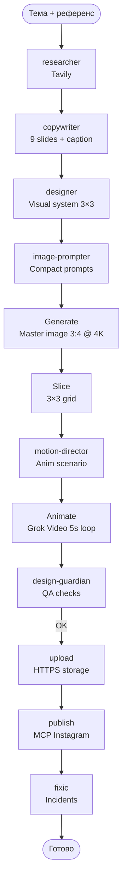

# Carusel — Пайплайн Instagram Carousel (9 slides, grid 3×3)



## Формат

| Параметр | Значение |
|----------|----------|
| Слайдов | **9** |
| Генерация | **1** master image `3:4` @ `4K` |
| Нарезка | **3×3** grid |
| Анимация | **slide-01** only (loop 5s) |

## Шаги

| # | Agent | Выход | Tool |
|---|-------|-------|------|
| 1 | carusel-researcher | `01-research.md` | Tavily MCP |
| 2 | carusel-copywriter | `02-copy.md` | — |
| 3 | carusel-designer | `03-design.md` | — |
| 4 | carusel-image-prompter | `04-prompts.md` | — |
| 5 | carusel-slice | `05-master.png` + `06-slices/*.png` | `image_gen.py` + `slice_grid.py` |
| 6 | carusel-motion-director | `07-motion.md` | — |
| 7 | carusel-animate | `08-anim-01.mp4` | Grok Video API |
| 8 | carusel-design-guardian | `09-qa.md` | `video_frame_qa.py` |
| 9 | carusel-upload | `10-upload.json` | `upload_carousel_assets.py` |
| 10 | carusel-publish | `11-publish.md` | Instagram MCP |
| 11 | carusel-fixic | `pipeline-fix-queue.md` | — |

## Структура сессии

```
~/.hermes/karuselka/sessions/{timestamp}/
├── 00-brief.md          # Бриф
├── 01-research.md       # Ресерч
├── 02-copy.md           # Текст
├── 03-design.md         # Дизайн
├── 04-prompts.md        # Промпты
├── 05-master.png        # Master image
├── 06-slices/           # 9 слайдов
│   ├── slide-01.png
│   ├── slide-02.png
│   └── ...
├── 07-motion.md         # Сценарий анимации
├── 08-anim-01.mp4       # Видео slide-01
├── 09-qa.md             # QA отчёт
├── 10-upload.json       # URL ассетов
├── 11-publish.md        # Результат публикации
├── pipeline-fix-queue.md # Очередь исправлений
└── fragments/           # Суммарные фрагменты
    ├── 01-research-summary.md
    ├── 02-copy-summary.md
    └── ...
```

## Handoff контракт

Каждый агент:
1. Читает `{SESSION_ROOT}/{step}-{prev}.md`
2. Пишет `{SESSION_ROOT}/{step}-{name}.md`
3. Создаёт `{SESSION_ROOT}/fragments/{step}-summary.md`
4. Если есть проблемы → добавляет в `pipeline-fix-queue.md`

## Использование

```bash
# Создание новой карусели
/carousel-new --topic "AI marketing tips" --reference "@neilpatel"

# Публикация готовой карусели
/carousel-publish --session-id ~/.hermes/karuselka/sessions/{timestamp}/
```

## Документация

- `HERMES_AGENTS.md` — маппинг агентов на навыки Hermes
- `SLASH_COMMANDS.md` — интеграция слэш-команд Hermes
- `shared/` — общие контракты и pitfalls